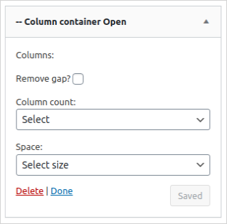
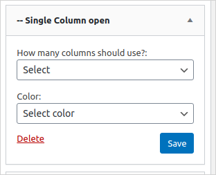

import CopyToClipBoard from "../src/components/CopyToClipboard.vue"
import { filters } from "../data/markdown-helpers/filters.js"

## Customize CSS
The styling of the theme is made up of [Sass](https://sass-lang.com/), [Bulma](https://bulma.io/), and the [CC Vocabulary](https://cc-vocabulary.netlify.app/). All the boilerplate for creating custom styles is in the **front** directory in the root of the CC Child Theme starter. All custom styles in **front/styles/** will override default theme styles as long as you use the same CSS classes used in the parent theme.

### Add Advanced CSS

_The instructions that follow assume that you have successfully installed the CC WP Base Theme Starter into your **wordpress**/**wp-content**/**themes** directory and activated it in your local development environment._

- Open the wordpress directory in a text editor or IDE of your choice.
- Navigate into  the **wordpress**/**wp-content**/**themes**/**cc-wp-base-theme-starter**/**front** directory.
- Install all the necessary node modules by running the command below in your terminal:

<CopyToClipBoard text="npm install"/>

- To add custom styles cd into the styles folder, add your styles in the relevant sass files. 
- Run the npm scripts below in your terminal, to watch and compile your styles respectively.
```
npm watch

npm build
```

## Advanced Widgets

The widgets in the theme can be divided into three categories: default WordPress widgets, layout widgets, as well as CC custom content widgets.

### Default WordPress Widgets 
These are widgets that come prepackaged in WordPress to learn more about them view [WordPress Widgets](https://wordpress.org/support/article/wordpress-widgets/).

### Layout Widgets
These widgets are used to design the structure of the widget areas. The layout widgets are powered by CSS Grid and they effectively work in pairs as it is outlined below.

#### Column Container Open and Column Container Close
These are used to create containers. Column Containers are blocks of space that are designed to wrap Single Column Widgets.
 
##### Column Container Open
The Column Container Open widget is used to initialize a container component.
Its parameters are shown in the screenshot below:



- Remove Gap: This parameter denotes horizontal the space in between inner columns as well as the space below and above the container, in css those spaces are defined by grid gap,  margin bottom, and margin top respectively. These all have a default value of 0.75rem.
- Column Count: This parameter will allow you to set the number of columns in the container.
- Space: This parameter denotes the vertical space in between inner columns.

##### Column Container Close
The Column Container Close widget is used to close an existing container. It essentially marks the end of a container that was opened using the Column Container Open widget. It has no parameters.

#### Single Column Open and Single Column Close
These widgets effectively form a single column structure which can be populated with any other widget. 
 
##### Single Column Open
The Single Column Open widget is used to initialize a column component.
Its parameters are shown in the screenshot below:



- How many columns should be used: This parameter is used to configure the span of a single column. The parent container (refer to the previous section for more details) consists of a fixed number of columns which are set using the parameter Column Count. The How many columns should use field will allow you to set the number of columns the single column should occupy from the preset number columns.
- Color: This parameter is used to set the background color of the single column.

##### Single Column Close
The Single Column Close widget is used to close an existing column. It essentially marks the end of a column that was opened using the Single Column Open widget. It has no parameters.

Follow the steps below to create a column container and populate it with a couple of widgets:

- Go to the ****Dashboard** > **Appearance** > **Widgets**
- Add the **Column Container Open** widget to the HomePage panel(or any other widget area of your choice in this example we are using the Homepage widget area)
- Provide the relevant parameters to the **Column Container Open** widget.
- Add the **Single Column Open** widget to the HomePage panel and configure it accordingly.
- Add any widgets of your choice to the Homepage Panel just immediately below the **Single Column Open** widget. As an example you may add the **CC Donation Banner** widget.
- To close off the column, add the widget **Single Column Close**.
- The final step is to add the Column Container Close widget to the Homepage panel so as to close off the Column Container.

### CC Custom Content Widgets
These widgets are prefixed by the acronym CC which stands for Creative Commons. They add custom Creative Commons assets and or content which may include social media content or special components derived from the CC Vocabulary.

- CC Card: this widget was adapted from [Cards](https://cc-vocabulary.netlify.app/?path=/story/layouts-cards--post-vertical), a CC Vocabulary Component.

- CC Notification: this widget was adapted from [Notification](https://cc-vocabulary.netlify.app/?path=/story/layouts-notification--warning), a CC Vocabulary Component.

## Hooks

Hooks enable users to insert their custom executable code into wordpress.

### Using Filters

The following filters are available in the theme:

**cc_theme_base_mandatory_sidebars**

Applied to expand the mandatory sidebars of the theme. It gets an array of the mandatory sidebars of the base theme as a parameter. The function should return an array with the sidebars:

<CopyToClipBoard :text="filters.sidebar" />

**cc_theme_base_menus**

Applied to add new menu placeholders. By default this theme has:

- Main menu
- Footer menu

```
array(
    'main-menu' => 'Main menu',
    'main-menu-mobile' => 'Main menu mobile',
    'footer' => 'Footer menu'
);
```
If you want to add new menu placeholder:

<CopyToClipboard :text="filters.placeholder" />

### Using Actions

The following actions are available in the theme:

- **cc_theme_before_header**: Action before the header element.
- **cc_theme_before_header_content**: Action inside element but before the header content.
- **cc_theme_after_header**: Action after the header element
- **cc_theme_after_header_content**: Action inside element but after the header content.
- **cc_theme_before_footer**: Action before the footer element.
- **cc_theme_before_footer_content**: Action inside element but before the footer content.
- **cc_theme_after_footer**:  Action after the footer element.
- **cc_theme_after_footer_content**: Action inside element but after the footer content.
